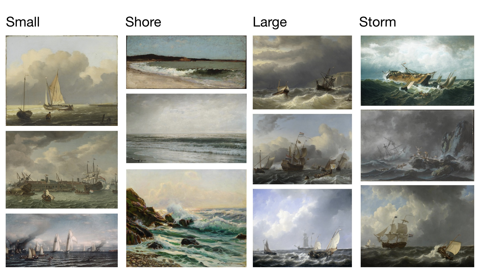
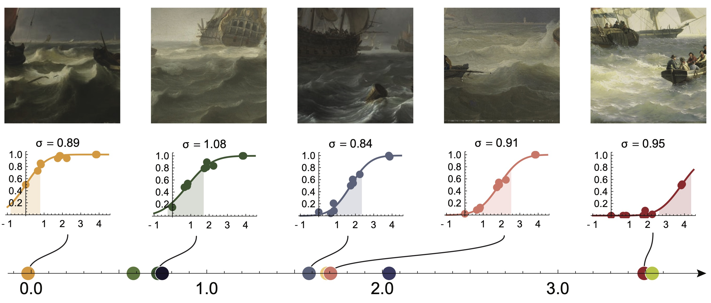
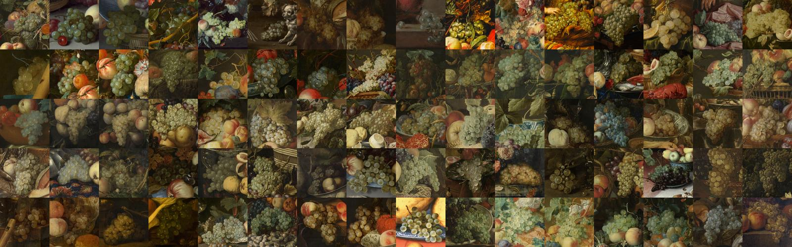
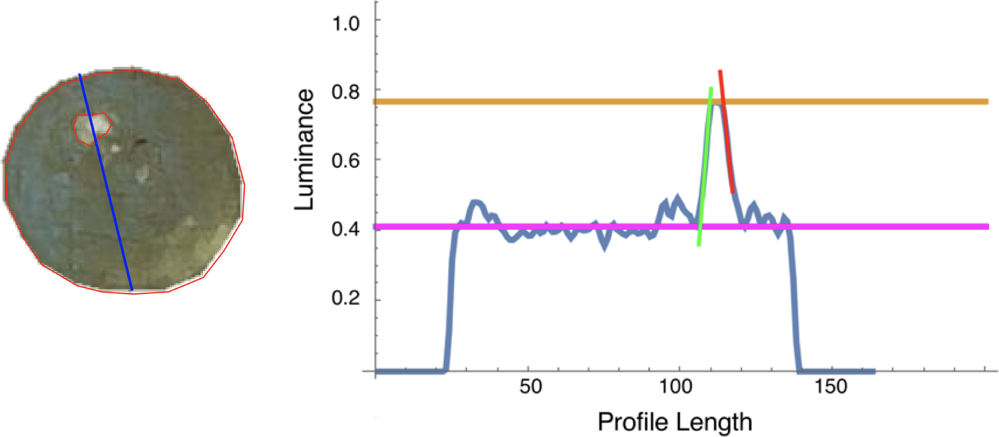
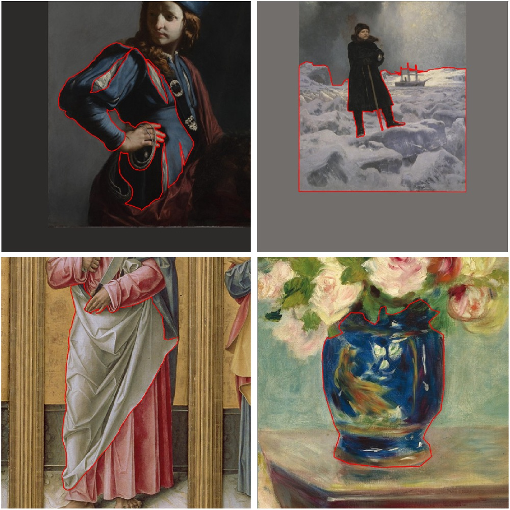
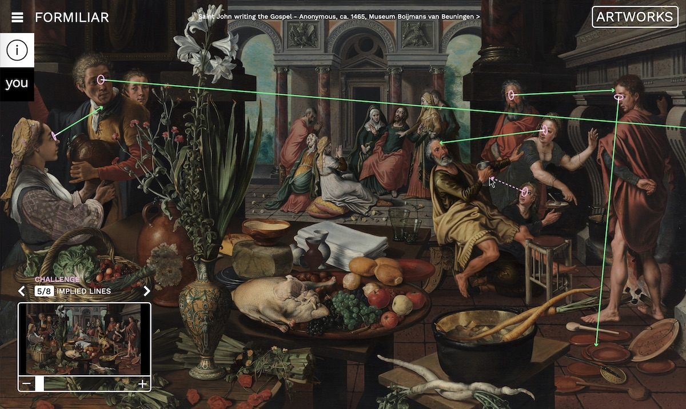
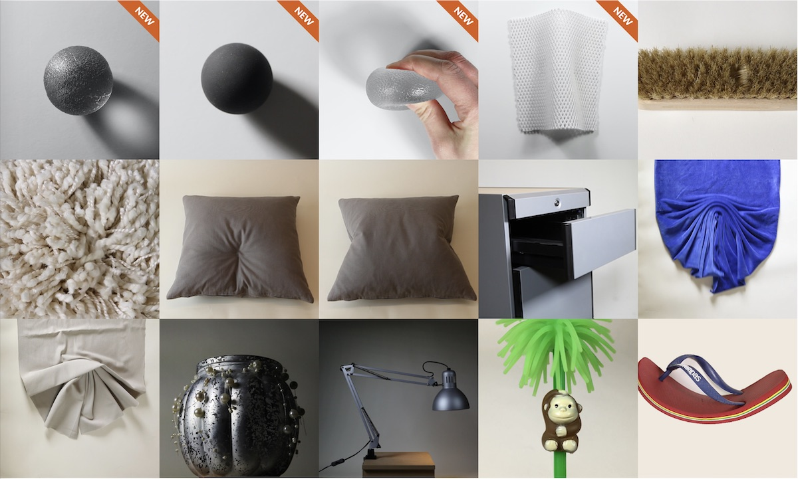

I teach and study visual perception and communication. Research topics mostly include phenomena that can be physically or mathematically described, such as light, space, shape, color and material properties. 

<!--The main two subjects i enjoy very much at the moment are:
- **Artistic material depictions**: we are creating a database of material depictions throughout art history. Main motivation is to see if we can learn something about perception from artists. Side motivations include digital art history and machine learning. 
- **Online shopping**: how to optimize movies and images so that raised expectations are met when the product is delivered? It is both an interesting societal problem (reduce returns & logistics) as well as a fundamentally interesting subject (difference between reality and representations).
-->

Besides these main research lines, I founded [Ways of Viewing](http://www.waysofviewing.com) which aims to enrich museum experiences with a synopter. Also, I very much enjoy teaching courses such as [Visual Communication Design](https://visualcommunicationdesign.github.io). Lastly, I should say I am a very big fan of [p5js](https://p5js.org), with which I made my [landing page](http://www.maartenwijntjes.nl). 

# Selection of publications

***

## Faces throughout art history

Title: **Conventions and temporal differences in painted faces: A study of posture and color distribution** 
Authors: van Zuijlen, Mitchell J.P.; Pont, Sylvia C.; Wijntjes, Maarten W.A.  
Source: [Electronic Imaging, Human Vision and Electronic Imaging 2020, pp. 267-1-267-8(8)](https://doi.org/10.2352/ISSN.2470-1173.2020.11.HVEI-267) 
Data: [Face database](https://doi.org/10.4121/uuid:3beee8ef-1b7e-451f-966f-13230cb2bbe7)

Before we started collecting hand annotated materials throughout art history, we wanted to practice in something that is relatively easy to automatically extract: faces! We got 11.6K of them are they), and analysed their posture and skin colour through history. 

The database is pretty cool because of the many parameters. In the demo below you see a selection of various 'yaw' angles while keeping pitch and roll more or less fixed (slide your mouse horizontally!):

	
  

    
Move mouse to see different orientations. 

  

Based on the face landmark data we could segment faces and isolate the *skin* color. We calculated mean, standard deviation and skewness values of luminance, saturation and hue. Below we visualized a bunch of faces ordered on mean hue:

	
  

    
A small selection of faces that were ordered on hue. 

  

***

## Online shopping - advantage of movies over pictures

Title: **Visual communication of how fabrics feel** 
Authors: Wijntjes, Maarten W.A.; Xiao, Bei; Volcic, Robert  
Source: [Journal of Vision (2019) Vol.19 (2), 4.](https://jov.arvojournals.org/article.aspx?articleid=2724349)

Jeans are fantastic research material, because they can *look* rather similar while *feel* very different. We checked whether you can infer how jeans feel from photos and videos, and found an advantage of videos. We also discussed some more methodological issues concerning this awesome topic of comparing reality with representation.  

<video width=853px height=480px controls>
  <source type="video/mp4" src="images/gstar480.mp4">
</video>

  

    
Movie fragments from which observers inferred haptic characteristics. 

  

***

## Translucent waves
Title: **Thurstonian Scaling and the Perception of Painterly Translucency** 
Authors: Wijntjes, Maarten W.A.; Spoiala, Cristina; de Ridder, Huib  
Source: [Art & Perception (in press) 2020](https://doi.org/10.1163/22134913-bja10021) or [this manuscript pdf (if you don't have a subscription for Art & Perception)](assets/Thurstonian_scaling_and_the_perception_of_painterly_translucency.pdf).

After looking at many paintings of the sea we wondered what topic would be interesting to dive into. What we really liked about seas is that it is a (somewhat) similar *material* but takes on vastly different shapes and is illuminated in many different ways (clouded/partly clouded,sunsets etc!). 

	
  

    
Examples of the 4 categories we used.  

  

We explored the use of Thurstonian scaling: a well-known psychophysical scaling method that is based in pairwise comparisons ("which of these two stimuli/pictures is more [...]"). Because the scaling algorithm uses discrimination thresholds (so called "Just Noticeable Distances") to reconstruct distances, we thought it would be interesting to introduce the concept of Number of Distinguishable Levels (NDLs). It basically equates how many perceivable shades of something (e.g. [greyness](https://en.wikipedia.org/wiki/Fifty_Shades_of_Grey)) are present. 

	
  

    
Thurstonian scaling of wave translucency (with cool psychometric curves;).  

  

## 17th century grape paintings
Title: **Understanding gloss perception through the lens of art: Combining perception, image analysis, and painting recipes of 17th century painted grapes**
Authors: Di Cicco, Francesca ; Wijntjes, Maarten W. A. ; Pont, Sylvia C. 
Source:[Journal of Vision 2019;19(3):7](https://jov.arvojournals.org/article.aspx?articleid=2728938)

	
  

    
Cross section of image luminance values along the highlight. Contrast is determined by horizontal lines, sharpness by the red and green slopes. 

  

Grapes are not only nice to eat or make wine from, they are also very interesting to look at. The surface has various qualities because there is a gloss that signals ripeness or wetness, it sometimes looks 'dusty' (which is bloom) and the colors can vary from red, green ('white' grapes) to blue. And under the skin, the pulp allows the passage of light creating beautiful inner reflections. So more than enough reasons to do some perception experiments on! In this study we related perception of glossiness to painterly tricks. 

	
  

    
Cross section of image luminance values along the highlight. Contrast is determined by horizontal lines, sharpness by the red and green slopes. 

  

Visual perception of gloss is well studied topic and one of the findings is that contrast and sharpness determine gloss. So we combined manual annotations with a simple computations of these two gloss cues and indeed found that they are strong predictors (could explain 69% of the variance).

## On the relations between properties and categories. 
Title: **Painterly depiction of material properties** 
Authors: van Zuijlen, Mitchell  ; Pont, Sylvia C. ; Wijntjes, Maarten W. A. 
Source:[Journal of Vision 2020;20(7):7](https://jov.arvojournals.org/article.aspx?articleid=2770257)

The study of material perception and depiction involves both material *categories* and their *properties*. The categories are what you call them, for example glass, iron, paper, fabric etc. The properties involve aspects such as glossiness, weight, roughness etc. I think that the combination of categories and properties make material perception so interesting: it does not only concern *what* you see but also involves all its qualities.

	
  

    
Segmentation of various materials 

  

In this study we first collected a set of 450 painting segments that consisted of 15 categories. Then we measured the perception of 10 properties for each category. 

# Ongoing research
- to be updated soon!

# Interesting student projects

## Formiliar

	
  

    
Formiliar, by Malou Kortleve 

  

Formiliar is digital a tool with which users can explore artworks by completing challenges, all focussing on visual elements in paintings. The main aim of the application is to encourage users to look closely at the paintings and to familiarise with them visually. Through multiple challenges users will look at the way elements, such as colour or composition, are applied in a specific painting and will get a peek into the artist’s process and considerations. By exploring, dissecting, manipulating, zooming into and comparing the artwork, the effects of different visual elements on the user’s perception are shown.

- [Prototype website (only partially functional)](https://www.maloukortleve.nl)

## Cinematics for online shopping

	
  

    
Online shopping, interactive. 

  

In online stores, the lack of physical contact with products could sometimes make it difficult for customers to clearly evaluate the product. Clothing, for example, without direct touching people might not be confident about purchasing because there is not enough information for the material. To start with, insights on how people interact with products in real life were gathered through in-store observation. Sketches were made and clustered to provide the basis for prototyping. After an iteration process, 12 final prototypes of interactive movies were made [online](https://xiehowe.github.io). 

<!--

-->

# Bio
After my finishing my MSc. degree in Physics (Groningen University), I wanted to do something else and discovered a very cool research field: Perception! It is an area crowded by many different scientific disciplines and I have enjoyed this ever since starting my PhD on haptic perception at the Physics department of Utrecht University. After 4 years of letting participants feel thousands of parameterised shapes and line drawings, I started as a post-doc on visual perception at Delft University of Technology, faculty of Industrial Design Engineering. In 2012 I became (tenured) assistant professor and have been teaching Visual Communication Design, Lighting Design, and Colour Ergonomics. 

My research in Delft started with ecological optics but I quickly became interested in pictorial space, the perception of depth in pictures and paintings. In 2010 I received an NWO VENI grant to work on these ideas. The outcomes were novel methods to quantify visual depth perception and insights on the difference between real and pictorial depth. In 2014 I became interested in material perception and started an NWO funded collaboration with G-Star to study what material properties consumers perceive in (online) pictures. These ideas catalysed a larger project that was awarded a NWO VIDI grant (2016) about the depiction of material properties. In this (ongoing) project, we are annotating large online collections with labels of depicted materials in paintings. Through rich annotations we are trying to extract the artist’s knowledge about visual material perception. This project is in tandem with a NICAS/NWO funded project about the pictorial recipes of golden age painter/writer Willem Beurs. Furthermore, I am also involved as a PhD supervisor on a Marie Curie Training Network grant. 

## Museum collections with nice high quality pictures

- [Metropolitan](https://www.metmuseum.org/art/collection/)
- [Rijksmuseum](https://www.rijksmuseum.nl/en/search)
- [The Getty](https://www.getty.edu/art/collection/)
- [National Gallery of Art (Washington)](https://www.nga.gov/collection/collection-search.html)
- [Nationalmuseum Stockholm (@wikimedia)](https://commons.wikimedia.org/wiki/Category:Media_contributed_by_Nationalmuseum_Stockholm:_2016-100)
- [Prado](https://www.museodelprado.es/en/the-collection)
- [Mauritshuis](https://www.mauritshuis.nl/en/explore/the-collection/search/)
- [wikimedia](https://commons.wikimedia.org/wiki/Main_Page)
- [Art Institute Chicago](https://www.artic.edu/collection)
- [Cleveland museum of art](http://www.clevelandart.org/)
- [Paris Musées](http://parismuseescollections.paris.fr/en)
- [general list I found](http://www.openculture.com/2016/05/1-8-million-free-works-of-art-from-world-class-museums-a-meta-list.html)

