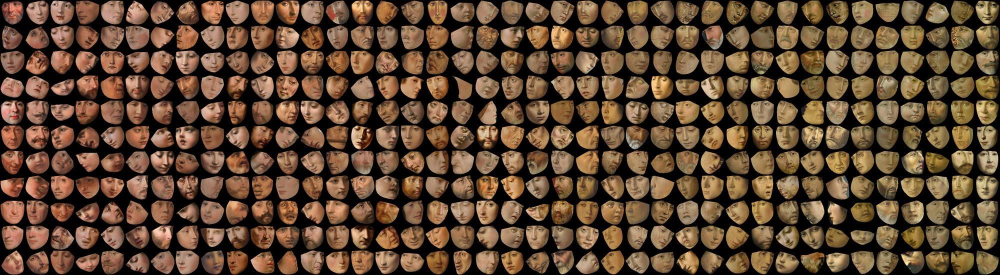

I teach and study visual perception and communication. <i>"of what?"  i hear you thinking... good question</i>. Mostly subjects that can also be physically or mathematically described, such as light, space, shape and material properties. The main two subjects i enjoy very much at the moment are:
- **Artistic material depictions**: we are creating a database of material depictions throughout art history. Main motivation is to see if we can learn something about perception from artists. Side motivations include digital art history and machine learning. 
- **Online shopping**: how to optimize movies and images so that raised expectations are met when the product is delivered? It is both an interesting societal problem (reduce returns & logistics) as well as a fundamentally interesting subject (difference between reality and representations).

Besides these main research lines, I study and produce the [synopter](http://www.waysofviewing.com) and enjoy teaching courses such as [Visual Communication Design](https://visualcommunicationdesign.github.io).

# Research selection

Title: **Conventions and temporal differences in painted faces: A study of posture and color distribution** 
Authors: van Zuijlen, Mitchell J.P.; Pont, Sylvia C.; Wijntjes, Maarten W.A.  
Source: [Electronic Imaging, Human Vision and Electronic Imaging 2020, pp. 267-1-267-8(8)](https://doi.org/10.2352/ISSN.2470-1173.2020.11.HVEI-267)

Before we started collecting hand annotated materials throughout art history, we wanted to practice in something that is relatively easy to automatically extract: faces! We got 11.6K of them ([here](https://doi.org/10.4121/uuid:3beee8ef-1b7e-451f-966f-13230cb2bbe7) are they), and analysed their posture and skin colour through history. 

The database is pretty cool because of the many parameters. In the demo below you see a selection of various 'yaw' angles while keeping pitch and roll more or less fixed (slide your mouse horizontally!):

 

Or look at this mesmerizing picture (including some face detection errors!), where I sorted on hue value:
 

<video width="960" height="540" controls loop>
  <source type="video/mp4" src="images/gstar.mp4">
</video>

<!--

-->

# Bio
After my finishing my MSc. degree in Physics (Groningen University), I wanted to do something else and discovered a very cool research field: Perception! It is an area crowded by many different scientific disciplines and I have enjoyed this ever since starting my PhD on haptic perception at the Physics department of Utrecht University. After 4 years of letting participants feel thousands of parameterised shapes and line drawings, I started as a post-doc on visual perception at Delft University of Technology, faculty of Industrial Design Engineering. In 2012 I became (tenured) assistant professor and have been teaching Visual Communication Design, Lighting Design, and Colour Ergonomics. 

My research in Delft started with ecological optics but I quickly became interested in pictorial space, the perception of depth in pictures and paintings. In 2010 I received an NWO VENI grant to work on these ideas. The outcomes were novel methods to quantify visual depth perception and insights on the difference between real and pictorial depth. In 2014 I became interested in material perception and started an NWO funded collaboration with G-Star to study what material properties consumers perceive in (online) pictures. These ideas catalysed a larger project that was awarded a NWO VIDI grant (2016) about the depiction of material properties. In this (ongoing) project, we are annotating large online collections with labels of depicted materials in paintings. Through rich annotations we are trying to extract the artist’s knowledge about visual material perception. This project is in tandem with a NICAS/NWO funded project about the pictorial recipes of golden age painter/writer Willem Beurs. Furthermore, I am also involved as a PhD supervisor on a Marie Curie Training Network grant. 

## Museum collections with nice high quality pictures

- [Metropolitan](https://www.metmuseum.org/art/collection/)
- [Rijksmuseum](https://www.rijksmuseum.nl/en/search)
- [The Getty](https://www.getty.edu/art/collection/)
- [National Gallery of Art (Washington)](https://www.nga.gov/collection/collection-search.html)
- [Nationalmuseum Stockholm (@wikimedia)](https://commons.wikimedia.org/wiki/Category:Media_contributed_by_Nationalmuseum_Stockholm:_2016-100)
- [Prado](https://www.museodelprado.es/en/the-collection)
- [Mauritshuis](https://www.mauritshuis.nl/en/explore/the-collection/search/)
- [wikimedia](https://commons.wikimedia.org/wiki/Main_Page)
- [Art Institute Chicago](https://www.artic.edu/collection)
- [Cleveland museum of art](http://www.clevelandart.org/)
- [Paris Musées](http://parismuseescollections.paris.fr/en)
- [general list I found](http://www.openculture.com/2016/05/1-8-million-free-works-of-art-from-world-class-museums-a-meta-list.html)

